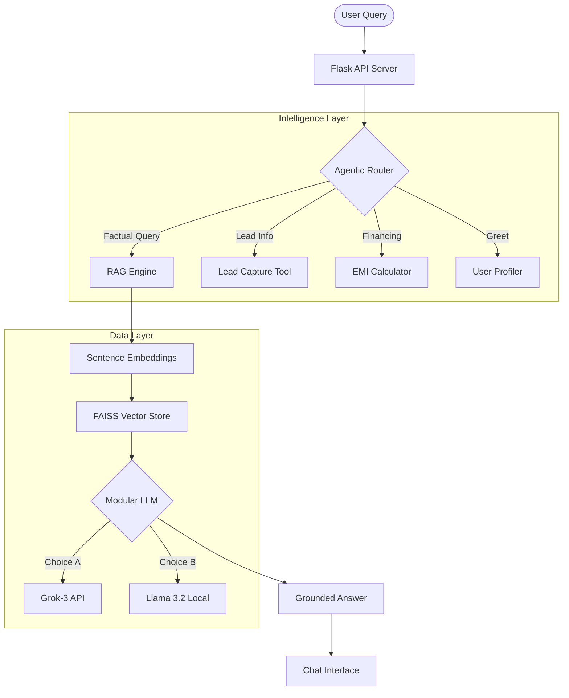

# 🎓 MastersUnion AI Course Assistant — Technical Documentation

## 🚀 Overview
The **MastersUnion AI Course Assistant** is a high-performance Retrieval-Augmented Generation (RAG) system designed to provide prospective students with instant, accurate, and verifiable information about academic programs. 

By grounding every response in official data scraped from the MastersUnion website, the system eliminates hallucinations while providing an "always-on" guidance counselor experience.

---

## 🏗️ System Architecture



---

## 🛠️ Technology Stack

### **1. Frontend (User Experience)**
*   **HTML5/JS**: Vanilla implementation for maximum performance and compatibility.
*   **Tailwind CSS**: Modern utility-first styling for a premium, responsive UI.
*   **Aesthetics**: Glassmorphism effects, smooth staggered animations, and a "MastersUnion" branded design system.

### **2. Backend (Orchestration)**
*   **Python/Flask**: Lean and scalable API server handling query routing and tool execution.
*   **Dotenv**: Secure environment configuration for API keys and RAG parameters.

### **3. RAG & Vector Intelligence**
*   **FAISS (Facebook AI Similarity Search)**: Local vector database for millisecond-speed retrieval of semantic matches.
*   **Sentence-Transformers (`all-MiniLM-L6-v2`)**: Transforms text into 384-dimensional dense vectors with high semantic accuracy.
*   **LangChain**: Industrial-strength orchestration for document chunking and metadata management.

### **4. Large Language Models (LLMs)**
*   **Primary (Performance)**: **xAI Grok-3-mini** (via OpenAI-compatible SDK) for complex instruction following.
*   **Secondary (Privacy/Local)**: **Llama 3.2:1B** running via Ollama for cost-effective local inference.

---

## 📊 Data Pipeline

1.  **Ingestion**: A custom web scraper (`BeautifulSoup4` + `Requests`) crawls mastersunion.org.
2.  **Processing**: Content is cleaned, normalized, and mapped to specific program identities.
3.  **Vectorization**: `RecursiveCharacterTextSplitter` breaks data into 400-word chunks with 60-word overlap to preserve context.
4.  **Indexing**: Chunks are embedded and stored in a local `.index` file for persistent retrieval.

---

## ✨ Key Innovation: "Agentic Tools"

Unlike basic chatbots, this system features an **Agentic Layer** that triggers specific tools based on user intent:

| Tool | Trigger | Action |
| :--- | :--- | :--- |
| **Lead Capture** | Intent to apply / Contact info | Automatically extracts Name/Email/Phone and saves to `leads.json`. |
| **EMI Calculator** | Fee/Finance queries | Dynamically calculates monthly installments based on program cost. |
| **Course Clarifier**| Vague queries | Identifies missing program context and asks clarifying questions. |
| **The Guardian** | Prompt injection / Off-topic | Enforces strict adherence to admissions-only scope. |

---

## 🛡️ Anti-Hallucination Design
The core principle of this project is **Zero Hallucination**. 
*   **Grounded Context**: The LLM is provided with exactly 4-5 relevant "Knowledge Chunks".
*   **Strict Constraints**: The system prompt explicitly forbids using training data.
*   **Fallback Logic**: If zero relevant data is found, the system provides official contact details instead of "guessing".

---

## 💻 Setup & Installation

```bash
# 1. Clone & Install
pip install -r requirements.txt

# 2. Build Knowledge Base
python src/scraper.py
python src/build_index.py

# 3. Launch Application
python app.py
```

---
*Developed for the MastersUnion Hackathon 2024*
